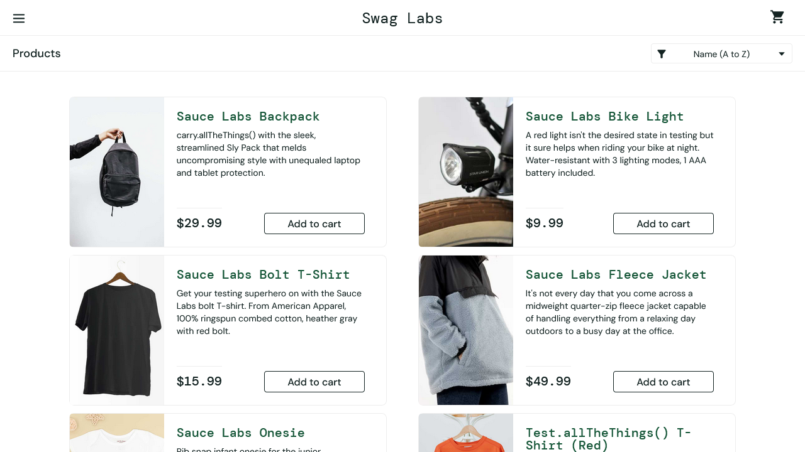
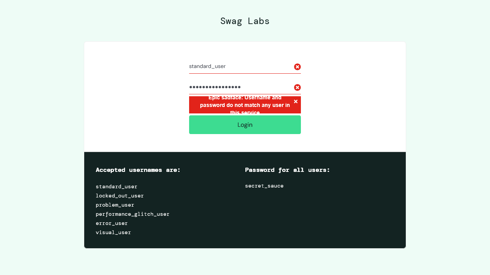
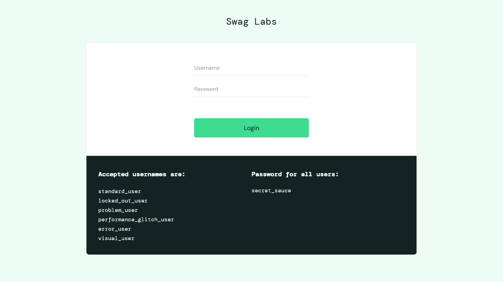

# Playwright Automation Framework

UI Automation Testing Project using Playwright and JavaScript.

## Project Objective

Automate login, logout validation for web applications.

## Test Scenario

1.Login Successfully
- Open Login Page
- Enter Username
- Enter Password
- Click Login
- Verify Successful Login

2.Login Failed: Invalid Password
- Open Login Page
- Enter Username
- Enter Invalid Password
- Click Login
- Verify Login Failed

3.Logout Successfully
- Open Login Page
- Enter Username
- Enter Password
- Click Login
- Homepage and Open Menu
- Click Logout
- Verify Back To Login Page and Verify Login Button


## Tools Used

- Playwright
- JavaScript
- Node.js
- Git

## Execute Test

```bash
npx playwright test
```

## Result

Test execution completed successfully.

## Screenshot



